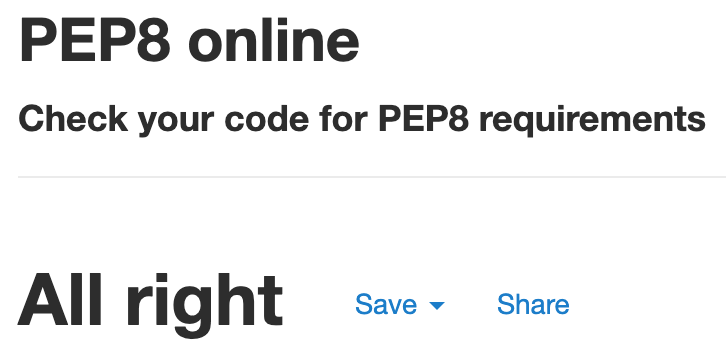

# Buzz of Berlin DRF API
(Developer: Vilayat Kleer)

This repository contains the API that was built using the Django REST Framework for the Buzz of Berlin front end application.

#### [View the live API](https://buzz-of-berlin-drf-api.herokuapp.com/)
#### [View the live front end application](https://ci-pp5-buzz-of-berlin.herokuapp.com/)
#### [View the front end repository](https://github.com/vkleer/ci-pp5-buzz-of-berlin)

## Table of Contents
  - [User Stories](#user-stories)
  - [Database](#database)
  - [Technologies Used](#technologies-used)
  - [Validation](#validation)
  - [Testing](#testing)
  - [Deployment](#deployment)
  - [Credits](#credits)

## User Stories

The back end of this project cover one large user story:
- As an admin, I want to be able to edit and delete all users' posts, recommendations, events, comments and likes, so I can moderate the application and remove any inappropriate content if needed


## Database

The following models were created to represent the database model structure of the application:


### Model

## Technologies Used

### Languages & Frameworks

- Python
- Django

### Libraries & Tools

## Validation

### Pep8 Validation
The Python code has been validated using [Pep8 Validation Service](http://pep8online.com/) - no errors or warnings were found.

<details><summary>Screenshot of Pep8 validation</summary>
    
</details>

## Testing

The following tests were carried out on the app:
1. Manual testing of user stories
2. Automated testing

### Manual Testing - User Stories

1. story

| **Feature** | **Action** | **Expected Result** | **Actual Result** |
|-------------|------------|---------------------|-------------------|
| feature | action | expected | result |

<details><summary>Supporting Screenshots - User Story 1</summary>
    
</details>

### Automated testing

## Deployment

### Heroku Deployment
This API has been deployed using Heroku with the following steps:

1. Login to [Heroku](https://id.heroku.com/login)
1. Go to your Heroku dashboard
3. In the top-right corner, click on the 'New' button, followed by the 'Create a new app' button
4. Enter an app name (it has to be unique) and choose your region under the 'Choose a region' dropdown menu.
5. Click on the 'Create app' button
6. Click on the 'Resources' tab and search for 'Postgres' in Add-ons section and add a 'Heroku Postgres' database to the app.
7. In your project, install the 'dj-database-url' and 'psycopg2' libraries using the following command:
    ```
    pip3 install dj_database_url psycopg2
    ```
8. In your settings.py file, import 'dj_database_url'
9. In your settings.py file, add the following to your 'DATABASES' variable to keep the development and production  databases separate:
    ```
    DATABASES = {
        'default': ({
            'ENGINE': 'django.db.backends.sqlite3',
            'NAME': BASE_DIR / 'db.sqlite3',
        } if 'DEV' in os.environ else dj_database_url.parse(
            os.environ.get('DATABASE_URL')
        ))
    }
    ```
10. In your project, install the 'django-cors-headers' and 'gunicorn' libraries using the following command:
    ```
    pip3 install django-core-headers gunicorn
    ```
11. In your settings.py file, add the django-cors-headers middleware class: 
    ```
    'corsheaders.middleware.CorsMiddleware'
    ```
12. In your settings.py, change the 'CORS_ALLOWED_ORIGIN_REGEXES' variable to the following to match your workspace URL:
    ```
    if 'CLIENT_ORIGIN_DEV' in os.environ:
        extracted_url = re.match(
            r'^.+-', os.environ.get('CLIENT_ORIGIN_DEV', ''), re.IGNORECASE
        ).group(0)
        CORS_ALLOWED_ORIGIN_REGEXES = [
            rf"{extracted_url}(eu|us)\d+\w\.gitpod\.io$",
        ]
    ```
13. Create a Profile file at the root of your project and add the following commands to it:
    ```
    release: python manage.py makemigrations && python manage.py migrate
    web: gunicorn PROJECT_NAME.wsgi
    ```
    The first line ensures that our migrations are made and applied to the Heroku postgres database, and the second line makes sure Heroku serves our app using gunicorn
14. In your settings file, set the 'ALLOWED_HOSTS' variable to the following:
    ```
    ALLOWED_HOSTS = [
      os.environ.get('ALLOWED_HOST'),
      'localhost',
    ]
    ``
15. In your settings.py file, create the 'JWT_AUTH_SAMESITE' variable and set it equal to 'None' to allow the front end app and API to be deployed separately
16. In your env.py file, add any remaining environment variables, like your 'SECRET_KEY'. Be sure to add your env.py file to your .gitignore file!
17. In your settings.py file, make any adjustments to your variables, like your 'SECRET_KEY':
    ```
    SECRET_KEY = os.environ.get('SECRET_KEY')
    ```
18. In your settings.py file, change the 'DEBUG' variable to the following:
    ```
    DEBUG = 'DEV' in os.environ
    ```
19. Update the requirements.txt file to ensure your Heroku deployment won't fail:
    ```
    pip3 freeze > requirements.txt
    ```
20. Add, commit and push your changes to GitHub
21. Back in your Heroku API page, click on the 'Settings' tab and create the environment variables you created in your env.py file under 'Config Vars'
22. Click on the 'Deploy' tab
23. Under 'Deployment method', click on 'Github'. You can then search for your repository under 'Search for a repository to connect to'
24. Click on the 'Connect' button to connect your repository
25. On the next page, under 'Choose a branch to deploy' you can choose the branch you want to deploy your app from
26. Either click on the 'Enable Automatic Deploys' button under 'Automatic deploys' to have the app deploy automatically on each push you make to the branch, or click on the 'Deploy Branch' button under 'Manual deploy'
27. Wait for the app to build and be deployed. Once the app is ready, a message will be displayed saying 'App was successfully deployed' along with a button which takes you to your newly deployed React app

## Credits

The assets were created by the developer.

### Code
- The DRF API for 'Buzz of Berlin' is the result of building on the Django REST API walkthrough project that was provided by Code Institute. Though it was used as a foundation, a bunch of extra apps and models have been added to make the back end of this project truly my own.
